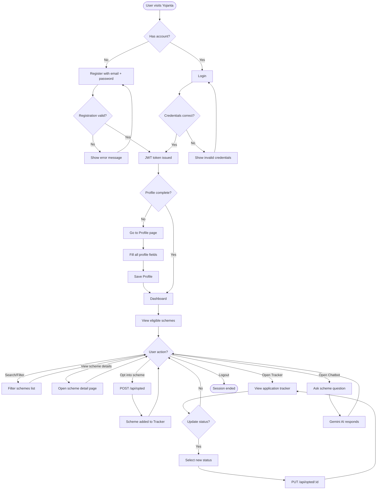
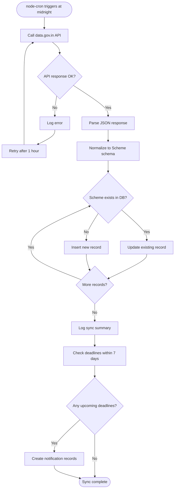

# Yojanta — Activity Diagram

> Render this file at [mermaid.live](https://mermaid.live) → export as PNG → save as `assets/architecture/activity-diagram.png`

## Main User Activity Flow

---

## Data Sync Activity (Background — runs daily)

