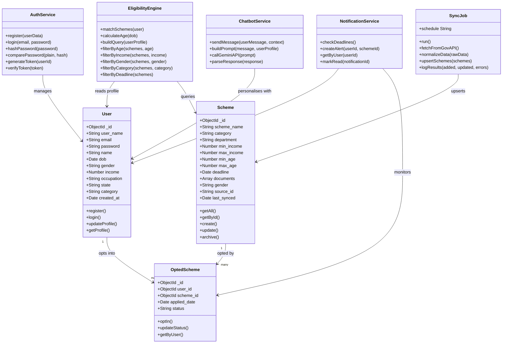

# Yojanta — Class Diagram

> Render this file at [mermaid.live](https://mermaid.live) → export as PNG → save as `assets/architecture/class-diagram.png`

---

## Class Descriptions

| Class | Type | Description |
|-------|------|-------------|
| `User` | Mongoose Model | Stores citizen profile and auth credentials |
| `Scheme` | Mongoose Model | Government scheme record with eligibility criteria |
| `OptedScheme` | Mongoose Model | Junction — tracks user applications per scheme |
| `EligibilityEngine` | Service Class | Core matching logic — filters schemes against user profile |
| `AuthService` | Service Class | Registration, login, JWT generation and verification |
| `SyncJob` | Background Job | Fetches and normalizes data.gov.in scheme data daily |
| `NotificationService` | Service Class | Generates and retrieves deadline alerts for users |
| `ChatbotService` | Service Class | Handles Gemini API communication for AI chatbot |
