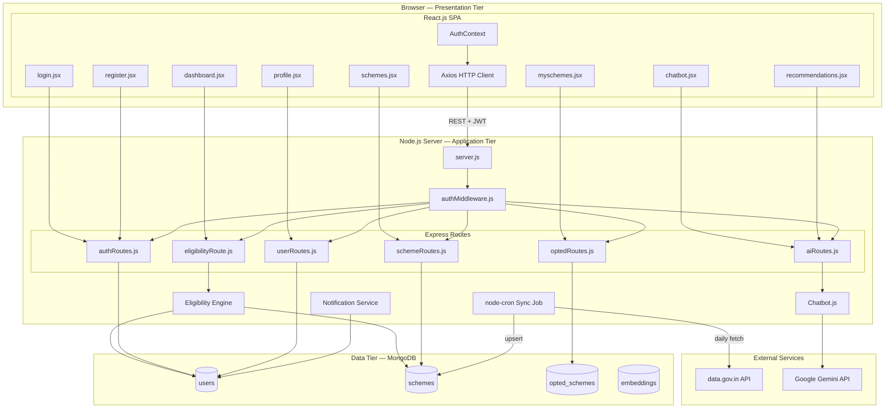

# Yojanta — Component Diagram

> Render this file at [mermaid.live](https://mermaid.live) → export as PNG → save as `assets/architecture/component-diagram.png`

---

## Component Descriptions

| Component | Layer | Responsibility |
|-----------|-------|---------------|
| `login.jsx` / `register.jsx` | Frontend | Auth UI forms |
| `dashboard.jsx` | Frontend | Displays eligible schemes from eligibility engine |
| `schemes.jsx` | Frontend | Browse and filter all schemes |
| `chatbot.jsx` | Frontend | Chat interface connected to Gemini AI |
| `myschemes.jsx` | Frontend | Application tracker UI |
| `AuthContext` | Frontend | Stores JWT token, user state globally |
| `Axios HTTP Client` | Frontend | Makes all API calls with JWT header |
| `server.js` | Backend | Entry point — starts Express, cron jobs |
| `authMiddleware.js` | Backend | Validates JWT on every protected request |
| `Eligibility Engine` | Backend | Matches user profile against scheme criteria |
| `Chatbot.js` | Backend | Sends messages to Gemini, returns AI responses |
| `node-cron Sync Job` | Backend | Fetches and normalizes data from data.gov.in daily |
| `Notification Service` | Backend | Checks deadlines, creates alerts for users |
| `users` collection | Database | Stores user profiles and credentials |
| `schemes` collection | Database | Stores all government scheme records |
| `opted_schemes` collection | Database | Tracks user applications and statuses |
| `data.gov.in API` | External | Source of government scheme data |
| `Google Gemini API` | External | Powers AI chatbot and recommendations |
