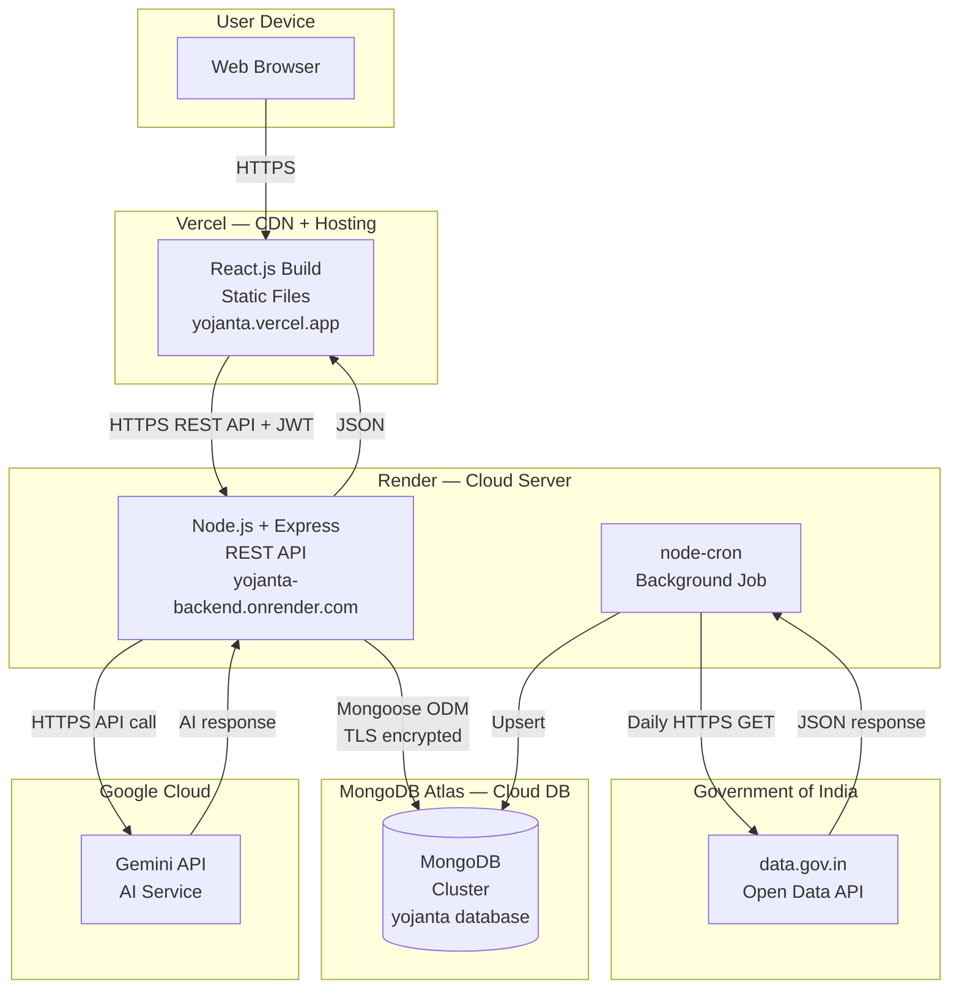

# Yojanta — Deployment Diagram

> Render this file at [mermaid.live](https://mermaid.live) → export as PNG → save as `assets/architecture/deployment-diagram.png`



---

## Infrastructure Notes

| Component | Platform | URL | Notes |
|-----------|----------|-----|-------|
| Frontend | Vercel | `https://yojanta.vercel.app` | Auto-deploys on git push to main |
| Backend | Render | `https://yojanta-backend.onrender.com` | Free tier spins down after 15min inactivity |
| Database | MongoDB Atlas | M0 Free Cluster | 512MB storage, shared cluster |
| AI | Google Gemini | API endpoint | Pay-per-use, generous free tier |
| Govt Data | data.gov.in | Open API | Free, requires API key |

## CI/CD Flow

```
Developer pushes to GitHub main branch
              │
     ┌────────┴────────┐
     ▼                 ▼
Vercel auto-builds   Render auto-builds
React frontend       Node.js backend
     │                 │
     ▼                 ▼
Deploy to CDN      Deploy to server
~2 min             ~3 min
```
