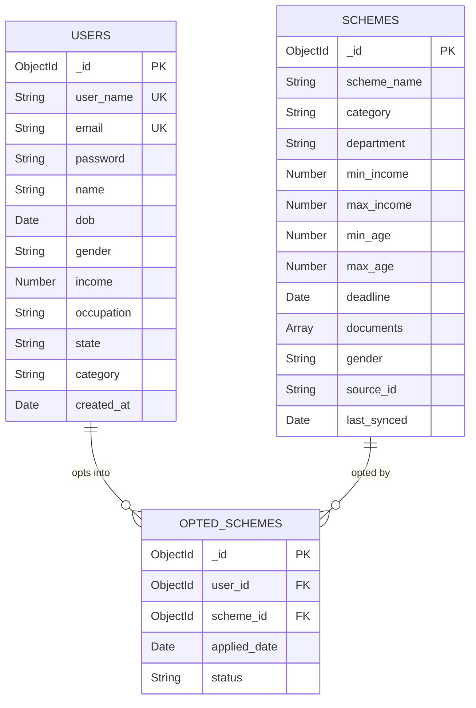

# Yojanta — Entity Relationship Diagram

## Relationships Explained

| Relationship | Type | Description |
|---|---|---|
| USERS → OPTED_SCHEMES | One to Many | One user can opt into multiple schemes |
| SCHEMES → OPTED_SCHEMES | One to Many | One scheme can be opted into by multiple users |
| OPTED_SCHEMES | Junction | Links users and schemes with status tracking |

## Field Notes

| Field | Note |
|---|---|
| `password` | bcrypt hashed — never stored as plaintext |
| `source_id` | Original ID from data.gov.in — used for daily upsert sync |
| `status` | Enum: opted → applied → approved / rejected |
| `dob` | Date of Birth — used to calculate age at query time |
| `gender` in schemes | "All" means any gender is eligible |
