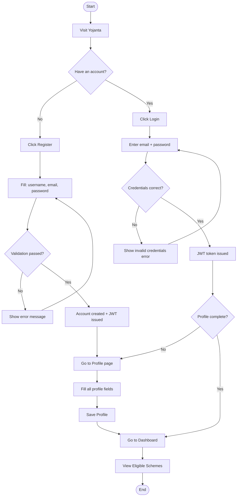
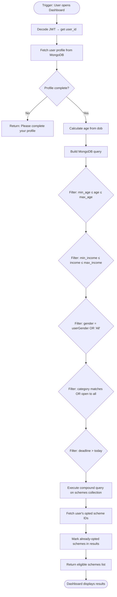
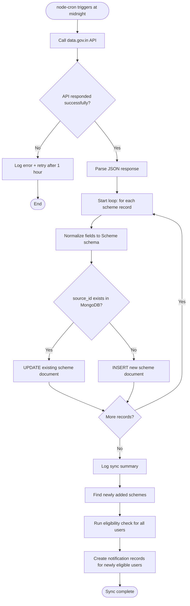
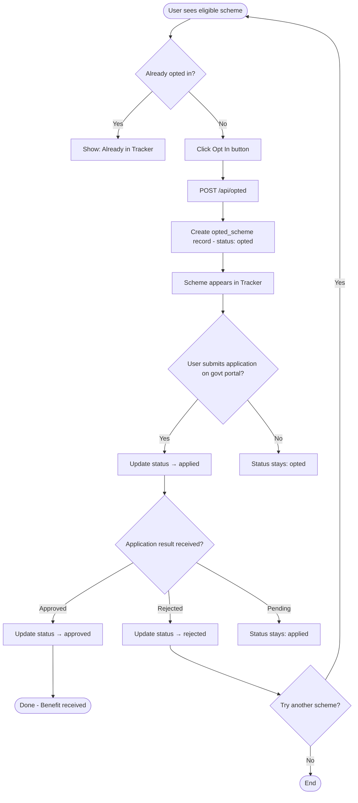

# Yojanta — Flowcharts

---

## 1. User Onboarding Flowchart

```mermaid
flowchart TD
    A([Start]) --> B[Visit Yojanta]
    B --> C{Have an account?}
    C -->|No| D[Click Register]
    C -->|Yes| E[Click Login]
    D --> F[Fill: username, email, password]
    F --> G{Validation passed?}
    G -->|No| H[Show error message]
    H --> F
    G -->|Yes| I[Account created + JWT issued]
    E --> J[Enter email + password]
    J --> K{Credentials correct?}
    K -->|No| L[Show invalid credentials error]
    L --> J
    K -->|Yes| M[JWT token issued]
    I --> N[Go to Profile page]
    M --> O{Profile complete?}
    O -->|No| N
    O -->|Yes| P[Go to Dashboard]
    N --> Q[Fill all profile fields]
    Q --> R[Save Profile]
    R --> P
    P --> S[View Eligible Schemes]
    S --> T([End])
```

---

## 2. Eligibility Engine Flowchart

```mermaid
flowchart TD
    A([Trigger: User opens Dashboard]) --> B[Decode JWT → get user_id]
    B --> C[Fetch user profile from MongoDB]
    C --> D{Profile complete?}
    D -->|No| E[Return: Please complete your profile]
    D -->|Yes| F[Calculate age from dob]
    F --> G[Build MongoDB query]

    G --> H{Filter: min_age ≤ age ≤ max_age}
    H --> I{Filter: min_income ≤ income ≤ max_income}
    I --> J{Filter: gender = userGender OR 'All'}
    J --> K{Filter: category matches OR open to all}
    K --> L{Filter: deadline > today}

    L --> M[Execute compound query on schemes collection]
    M --> N[Fetch user's opted scheme IDs]
    N --> O[Mark already-opted schemes in results]
    O --> P[Return eligible schemes list]
    P --> Q([Dashboard displays results])
```

---

## 3. Daily Data Sync Flowchart

```mermaid
flowchart TD
    A([node-cron triggers at midnight]) --> B[Call data.gov.in API]
    B --> C{API responded successfully?}
    C -->|No| D[Log error + retry after 1 hour]
    D --> E([End])
    C -->|Yes| F[Parse JSON response]
    F --> G[Start loop: for each scheme record]
    G --> H[Normalize fields to Scheme schema]
    H --> I{source_id exists in MongoDB?}
    I -->|Yes| J[UPDATE existing scheme document]
    I -->|No| K[INSERT new scheme document]
    J --> L{More records?}
    K --> L
    L -->|Yes| G
    L -->|No| M[Log sync summary]
    M --> N[Find newly added schemes]
    N --> O[Run eligibility check for all users]
    O --> P[Create notification records for newly eligible users]
    P --> Q([Sync complete])
```

---

## 4. Application Tracking Flowchart

```mermaid
flowchart TD
    A([User sees eligible scheme]) --> B{Already opted in?}
    B -->|Yes| C[Show: Already in Tracker]
    B -->|No| D[Click Opt In button]
    D --> E[POST /api/opted]
    E --> F[Create opted_scheme record - status: opted]
    F --> G[Scheme appears in Tracker]
    G --> H{User submits application on govt portal?}
    H -->|Yes| I[Update status → applied]
    H -->|No| J[Status stays: opted]
    I --> K{Application result received?}
    K -->|Approved| L[Update status → approved]
    K -->|Rejected| M[Update status → rejected]
    K -->|Pending| N[Status stays: applied]
    L --> O([Done - Benefit received])
    M --> P{Try another scheme?}
    P -->|Yes| A
    P -->|No| Q([End])
```
