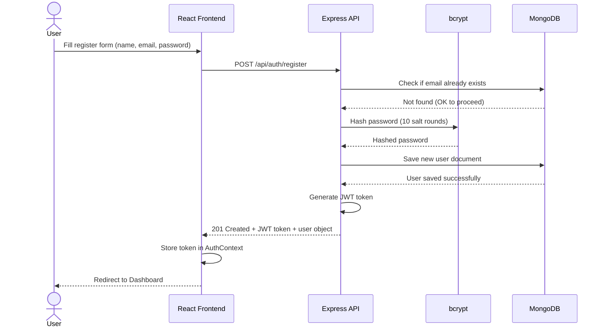
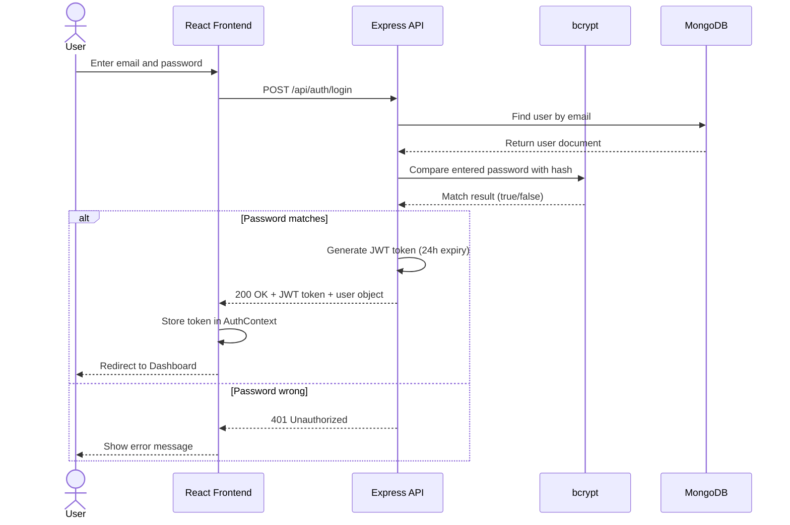
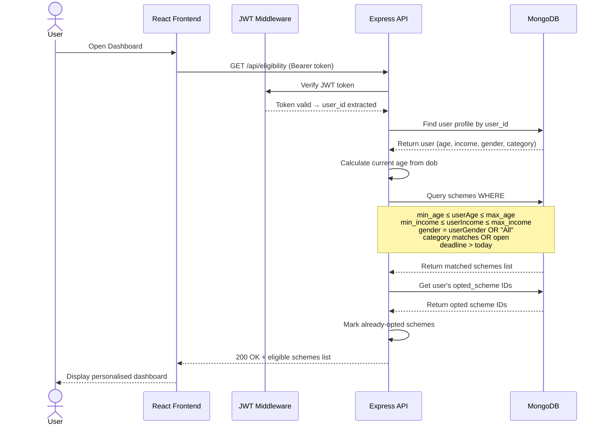
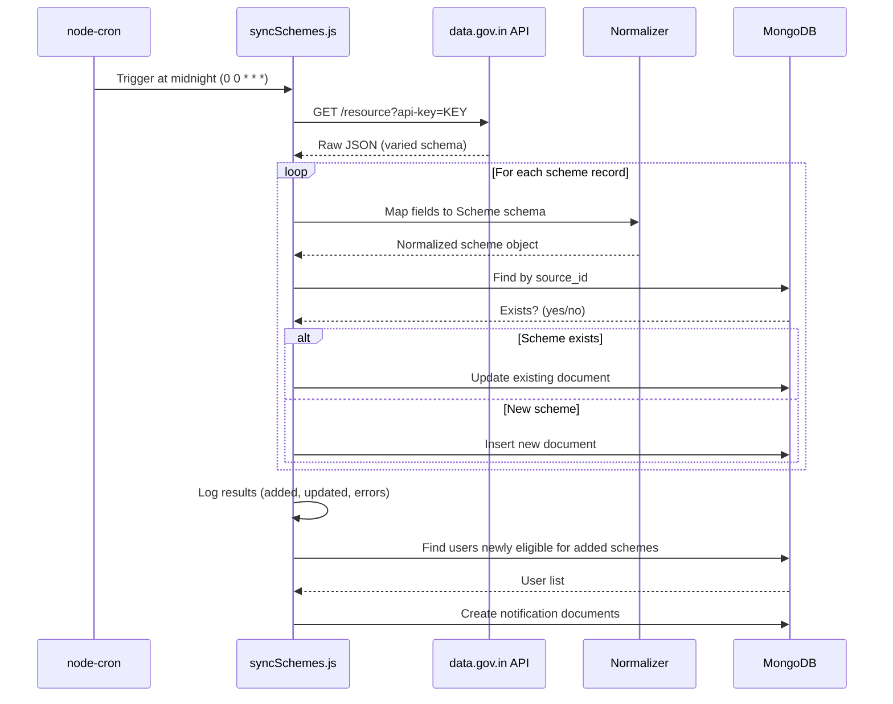
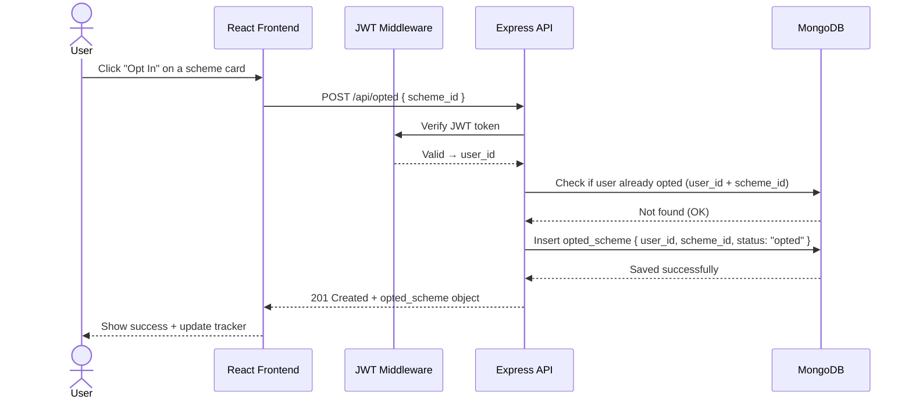

# Yojanta — Sequence Diagrams

---

## 1. User Registration Flow

---

## 2. User Login Flow

---

## 3. Eligibility Matching Flow

---

## 4. Daily Data Sync Flow (Cron Job)

---

## 5. Opt Into a Scheme Flow

