# Yojanta — Use Case Diagram

```mermaid
flowchart TD
    subgraph Actors
        U([👤 User / Citizen])
        A([🛠️ Admin])
        S([🤖 System / Cron])
    end

    subgraph UC["Use Cases — Yojanta"]
        UC1[Register Account]
        UC2[Login]
        UC3[Update Profile]
        UC4[View Eligible Schemes]
        UC5[Search & Filter Schemes]
        UC6[Opt Into Scheme]
        UC7[View Application Tracker]
        UC8[Update Application Status]
        UC9[View Notifications]
        UC10[Add New Scheme]
        UC11[Update Scheme Details]
        UC12[Archive Scheme]
        UC13[Sync Data from data.gov.in]
        UC14[Send Deadline Notifications]
    end

    U --> UC1
    U --> UC2
    U --> UC3
    U --> UC4
    U --> UC5
    U --> UC6
    U --> UC7
    U --> UC8
    U --> UC9

    A --> UC2
    A --> UC10
    A --> UC11
    A --> UC12

    S --> UC13
    S --> UC14
```

---

## Use Case Descriptions

### UC1 — Register Account
- **Actor:** User
- **Precondition:** User has valid email
- **Flow:** User fills registration form → system validates → bcrypt hashes password → user saved → JWT issued
- **Postcondition:** User is logged in with active JWT token

### UC2 — Login
- **Actor:** User, Admin
- **Precondition:** Account exists
- **Flow:** User enters credentials → bcrypt compares → JWT generated on match
- **Postcondition:** JWT token issued, user redirected to dashboard

### UC3 — Update Profile
- **Actor:** User
- **Precondition:** Logged in
- **Flow:** User fills profile fields → saved to MongoDB
- **Postcondition:** Profile saved; dashboard refreshes with updated eligibility

### UC4 — View Eligible Schemes
- **Actor:** User
- **Precondition:** Logged in + profile complete
- **Flow:** Eligibility engine queries schemes matching user profile
- **Postcondition:** Personalised scheme list displayed on dashboard

### UC5 — Search & Filter Schemes
- **Actor:** User
- **Precondition:** Logged in
- **Flow:** User enters keyword or selects filter → API returns filtered results
- **Postcondition:** Filtered scheme list displayed

### UC6 — Opt Into Scheme
- **Actor:** User
- **Precondition:** Logged in + scheme exists + not already opted
- **Flow:** User clicks Opt In → opted_scheme record created with status "opted"
- **Postcondition:** Scheme appears in Application Tracker

### UC7 — View Application Tracker
- **Actor:** User
- **Precondition:** Logged in + at least one opted scheme
- **Flow:** User opens Tracker → system fetches all opted_schemes for user
- **Postcondition:** Full list of opted schemes with statuses displayed

### UC8 — Update Application Status
- **Actor:** User
- **Precondition:** Scheme in tracker
- **Flow:** User selects new status from dropdown → PUT /api/opted/:id called
- **Postcondition:** Status updated in opted_schemes collection

### UC9 — View Notifications
- **Actor:** User
- **Precondition:** Logged in
- **Flow:** User opens notifications → system returns deadline alerts and new scheme alerts
- **Postcondition:** Notification list displayed

### UC10 — Add New Scheme
- **Actor:** Admin
- **Precondition:** Admin JWT token
- **Flow:** Admin fills scheme form → POST /api/schemes → saved to MongoDB
- **Postcondition:** Scheme available in database for eligibility matching

### UC11 — Update Scheme Details
- **Actor:** Admin
- **Precondition:** Scheme exists
- **Flow:** Admin edits fields → PUT /api/schemes/:id
- **Postcondition:** Updated scheme used in future eligibility queries

### UC12 — Archive Scheme
- **Actor:** Admin
- **Precondition:** Scheme exists
- **Flow:** Admin archives → scheme flagged inactive
- **Postcondition:** Scheme removed from eligibility results

### UC13 — Sync Data from data.gov.in
- **Actor:** System (Cron)
- **Precondition:** data.gov.in API accessible
- **Flow:** Daily trigger → fetch → normalize → upsert MongoDB
- **Postcondition:** Scheme database updated with latest government data

### UC14 — Send Deadline Notifications
- **Actor:** System (Cron)
- **Precondition:** Users with opted schemes exist
- **Flow:** Check deadlines within 7 days → create notification records for eligible users
- **Postcondition:** Notifications available for users on next login
